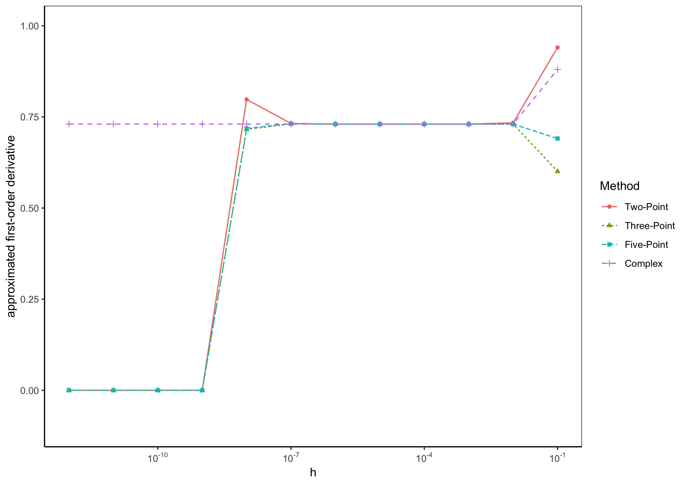

# Convergence of Numerical Differentiation Methods

There exist a wide range of numerical differentiation methods with different speed of convergence and accuracy. Finite difference formulas evaluate the function at different real points to approximate derivatives. However, as they converge to the true value of the derivative they fall victim to the round-off and subtractive cancellation error. These errors are due to the floating-point arithmetic of common computer systems, which fails to represent very small numbers with sufficient accuracy. An alternative to finite difference formulas is the complex step approach. As the name suggests, it evaluates functions at complex numbers. Fortunately, this prevents the subtractive cancellation error.

This code illustrates the advantage of the complex step approach over finite difference formulas.
By approximating the first-order derivative of the function

<a href="https://www.codecogs.com/eqnedit.php?latex=f(x)&space;=&space;(x^2)sin(1/x)" target="_blank"></a>

at the point x = 0.1 with the

* two-point formula \
<a href="https://www.codecogs.com/eqnedit.php?latex=f'(x)&space;\approx&space;\frac{f(x&plus;h)-f(x)}{h}" target="_blank"></a>
* three-point formula \
<a href="https://www.codecogs.com/eqnedit.php?latex=f'(x)&space;\approx&space;\frac{f(x&plus;h)-f(x-h)}{2h}" target="_blank"></a>
* five-point formula \
<a href="https://www.codecogs.com/eqnedit.php?latex=f'(x)&space;=&space;\frac{-f(x&plus;2h)&space;&plus;&space;8f(x&plus;h)&space;-8f(x-h)&space;&plus;f(x-2h)&space;}{12h}" target="_blank"></a>
* complex step approach \
<a href="https://www.codecogs.com/eqnedit.php?latex=f'(x)&space;\approx&space;\frac{Im(f(x&plus;ih)}{h}" target="_blank"></a>

The different convergence rates and the collapse of the finite different formulas at very small step sizes h are illustrated in a graph.



The finite difference methods collapse to zero with very small absolute values of the step size h due to the subtractive cancellation error. The complex step approach (purple crosses) meanwhile keeps on converging to the true value of the derivative.
### Code Structure

Load the necessary packages.
```r
# load packages
if (!require("pacman")) 
  install.packages("pacman"); library("pacman") 
p_load("dplyr", 
       "reshape2",
       "ggplot2",
       "xtable",
       "scales")
```
Define the function of which we want to find the derivative.
```
f <- function(v){
  y = (v^2)*sin(1/v)
  return(y)
}
```

Define the two-point formula function. It takes the target function, the x-value at which the derivative should be approximated, a starting value for the step size, and a maximum number of iterations as inputs.
It will approximate the derivative at y with h^1, h^2, ... h^max and return a vector of the approximation at these step sizes.
```
# Two-Point Formula
TwoPointRep <- function(f, x, hstart, max){
  # define function
  func <- f
  # empty matrix for returning values
  v <- 1:max
  mat <- matrix(rep(v,2), ncol = 2)
  # set counter to zero
  count = 0
  # start producing the derivatives
  repeat {
    count = count + 1
    h = hstart^count
    # 2point numerical derivative
    deriv <- (func(x+h)-func(x))/h
    mat[count,2] <- deriv
    if (count == max){
      break
    }
  }
  return(mat)
}
```
The three-point and five-point formula follow the same structure.


