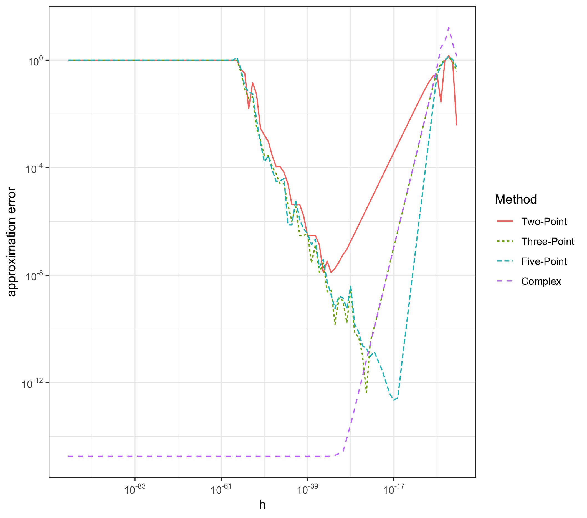

# The Dilemma of Choosing a Step-Size in Finite Difference Methods

Finite difference formulas in numerical differentiation theoretically deliver more accurate results the smaller their step size becomes. The approximation becomes more exact the closer the points used for the approximation are to the function value at which we want to obtain the derivative. This implies that the absolute step size should converge to zero.
However, finite difference methods use the difference between close function values to obtain the derivative. Common computer systems operate on a 64-bit floating-point arithmetic. This arithmetic aims to represent as wide a range of numbers with as much accuracy as possible. In particular, there is a minimum distance between each number that this system can represent.
Especially with very small absolute numbers near zero, computers cannot represent numbers with sufficient accuracy.
This leads to round-off errors and the subtractive cancellation error.
Take for example the two-point formula:

<a href="https://www.codecogs.com/eqnedit.php?latex=f'(x)&space;\approx&space;\frac{f(x&plus;h)-f(x-h)}{2h}" target="_blank"></a>.

As the step size h approaches zero, the computer will fail to represent the distance between the function values in the enumerator. This is because it becomes so close to zero. At first, the computer will round the distance to the next representable number. Because we divide by another small number this can produce rounding errors. Ultimately, the enumerator will become so small that the computer rounds it to zero - this makes the approximation useless!

This code produces a graph that illustrates the trade-off between large and small absolute step sizes in finite difference formulas. As an alternative, the complex step approach is used. The latter is unaffected by the subtractiv cancellation error and converges to the true derivative value long after the finite difference methods have deteriorated. For this reason the complex step approach is the standard in current numerical differentiation software packages (see for example NumDeriv in R).

<p align="center">

</p>

The dilemma was also illustrated in this way by Martins, Sturdza and Alonsa (2003). 
In this example the derivative of the function

<a href="https://www.codecogs.com/eqnedit.php?latex=f(x)&space;=&space;(x^2)sin(1/x)" target="_blank"></a>

is approximated at the point x = 0.1.

# Code Structure
Define the function of which we want to estimate the derivative.

```r
f <- function(v){
  y = (v^2)*sin(1/v)
  return(y)
}
```
Define the finite difference formulas and complex step approach. 

```r
# Two-Point Formula
TwoPointRep <- function(f, x, hstart, max){
  # define function
  func <- f
  # empty matrix for returning values
  v <- 1:max
  mat <- matrix(rep(v,2), ncol = 2)
  # set counter to zero
  count = 0
  # start producing the derivatives
  repeat {
    count = count + 1
    h = hstart^count
    # 2point numerical derivative
    deriv <- (func(x+h)-func(x))/h
    mat[count,2] <- deriv
    if (count == max){
      break
    }
  }
  return(mat)
}
```
The function allows to enter the target function, scalar x-value, a starting value for the step size. The input max determines for how many values the derivative should be approximated. The sequence of step sizes is h^1, h^2, ... h^max.

Then calculate the real value of the derivative

```r
# compute analytic derivative value
f.first <- function(v){
  y = 2*sin(1/v)*v-cos(1/v)
  return(y)
}
# true value of derivative
deriv.true <- f.first(0.1)
```

Then compute the relative error and plot it over the step-size, either as a .gif or .pdf/.jpg but make sure you disable the gganimate options when saving it as a .pdf/.jpg.

<p align="center">

</p>

# Sources
For the complex step approach:
 * Joaquim R. R. A. Martins, Peter Sturdza and Juan J. Alonso. *The Complex-Step Derivative Approximation*. ACM Transactions on Mathematical Software, Vol.29, No. 3, September 2003, Pages 245–262, 2003.
 * William Squire, George Trapp. *Using Complex Variables to Estimate Derivatives of Real Functions*. SIAM Rev. Vol. 40, No. 1 p. 110-112, 1998. \\

For finite difference formulas and the structure of the floating-point arithmetic:
* C. Woodford, C. Phillips. *Numerical Methods with Worked Examples: MatlabEdition*. Springer, p. 119-128, 2012.
* James E. Gentle. *Numerical Linear Algebra for Applications in Statistics*. George Mason University, p. 1 - 12, 1998
