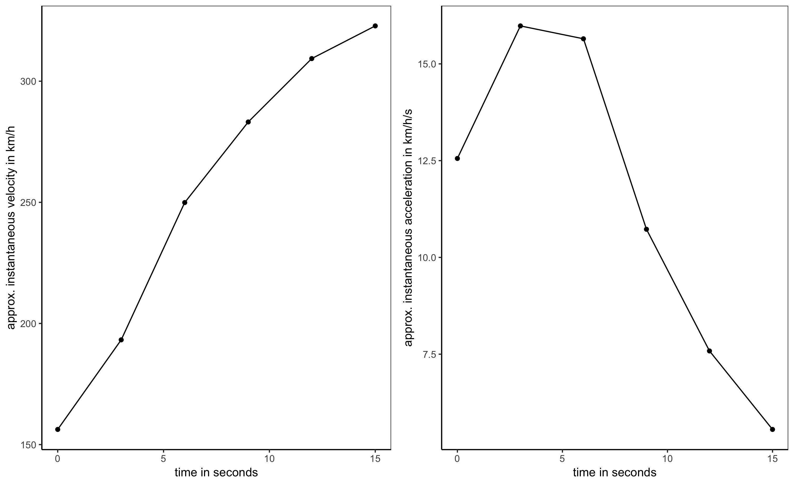
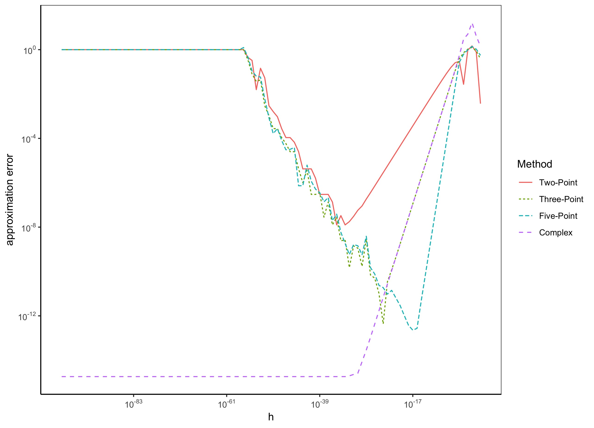

[](http://quantlet.de/)

## [](http://quantlet.de/) **Numerical Differentiation"** [](http://quantlet.de/)

```yaml
Name of Quantlet: Numerical Introductory Project

Published in: Numerical Introductory Seminar - Student Project on "Numerical Differentiation"

Description: Numerical Differentiation Methods

Keywords: differentiation, numerical methods, derivative, subtractive cancellation

Author: Clara Hoffmann

Submitted: Tue, February 12 2019

```


# NumericalDifferentiation






